# ⚡ ServiceSync
**Modern On-Demand Home Services Booking Platform**

ServiceSync is a full-stack MERN application that connects customers with service professionals (cleaners, plumbers, electricians) in real-time. It features a premium, optimistic UI, role-based dashboards, and an intelligent scheduling system.

---

## 🏗️ Architecture

The system follows a layered architecture with a clear separation of concerns.

```mermaid
%%{init: {'theme': 'base', 'themeVariables': { 'primaryColor': '#2563eb', 'edgeLabelBackground':'#ffffff', 'tertiaryColor': '#f1f5f9'}}}%%
graph TD
    classDef client fill:#e0f2fe,stroke:#0284c7,stroke-width:2px,color:#0c4a6e;
    classDef server fill:#f0fdf4,stroke:#16a34a,stroke-width:2px,color:#14532d;
    classDef db fill:#fefce8,stroke:#ca8a04,stroke-width:2px,color:#713f12;

    subgraph Frontend ["🖥️ Frontend (Vite + React)"]
        direction TB
        C_Dash[Customer Dashboard]:::client
        P_Dash[Partner Dashboard]:::client
        A_Panel[Admin Panel]:::client
        Optimistic[Optimistic UI Manager]:::client
    end

    subgraph Backend ["⚙️ Backend (Node.js + Express)"]
        direction TB
        Auth[JWT Middleware]:::server
        Router[API Router]:::server
        Controller[Controllers]:::server
        Service[Service Layer]:::server
        Cron[Status Scheduler]:::server
    end

    subgraph Data ["💾 Database"]
        MongoDB[(MongoDB Atlas)]:::db
    end

    C_Dash --> |Axios /bookings| Router
    P_Dash --> |Axios /assign| Router
    A_Panel --> |Axios /admin| Router

    Router --> Auth
    Auth --> Controller
    Controller --> Service
    Service --> |Mongoose| MongoDB
    Cron -.-> |Polls & Updates| MongoDB
    
    Optimistic -.-> |Immediate Feedback| C_Dash
    Optimistic -.-> |Immediate Feedback| P_Dash

    linkStyle default stroke:#64748b,stroke-width:2px;
```



### 🔁 Request Lifecycle & State Management
1.  **User Action**: User clicks "Book" or "Cancel".
2.  **Optimistic UI**: The frontend *immediately* updates the visuals (e.g., changes badge to "Cancelled") without waiting for the server.
3.  **API Request**: The request is sent to the backend in the background.
4.  **Reconciliation**: 
    *   **Success**: The server confirms the change.
    *   **Failure**: The UI reverts to the previous state and shows an error toast.

---

## 🛠️ Tech Stack

*   **Frontend**: React (Vite), CSS Variables (Theming), Lucide React (Icons), Axios.
*   **Backend**: Node.js, Express.js, JWT Authentication.
*   **Database**: MongoDB (Mongoose ODM).


---

## 💡 Design Decisions & Trade-offs

### 1. Optimistic UI over Loading States
*   **Decision**: We chose to implement optimistic updates for Booking cancellations and Status changes.
*   **Trade-off**: Increases frontend complexity (need to manage rollbacks) but significantly improves *perceived performance*. The app feels "instant" rather than laggy.

### 2. Short Polling vs. WebSockets
*   **Decision**: The dashboards use `setInterval` (polling) every 3-5 seconds to fetch updates.
*   **Trade-off**: WebSockets (Socket.io) would provide true real-time push, but introduce significant infrastructure complexity (connection handling, scaling).
*   **Assumption**: For the current scale (MVP), polling is sufficient and reliable.

### 3. CSS Variables vs. Tailwind
*   **Decision**: We used native CSS Variables (`--primary`, `--bg-page`) for theming.
*   **Reasoning**: Allows for easy runtime theme switching (Light/Dark mode future-proofing) and cleaner JSX without class clutter.

### 4. Separation of Booking & Discovery
*   **Decision**: Splitting "Home" (Discovery) and "My Bookings" (Management) into separate routes.
*   **Reasoning**: Reduces cognitive load. Users are either in "Shopping Mode" or "management Mode".

---

## 🚀 Getting Started

### Prerequisites
*   Node.js (v16+)
*   MongoDB (Local or Atlas URI)

### 1. Environment Setup

Create a `.env` file in the `backend/` directory:
```env
PORT=5000
MONGO_URI=mongodb://localhost:27017/servicesync
JWT_SECRET=your_super_secret_key_123
```

### 2. Installation

Install dependencies for both frontend and backend:

```bash
# Root directory - Install Backend Deps
cd backend
npm install

# Root directory - Install Frontend Deps
cd ../frontend
npm install
```

### 3. Database Seeding (Optional)

Create a default Admin user (`admin@servicesync.com` / `admin123`):

```bash
cd backend
node scripts/seedAdmin.js
```

### 4. Running the Project

You can run both servers simultaneously from the root (if a root `package.json` is set up) or separately.

**Frontend:**
```bash
cd frontend
npm run dev
# Runs on http://localhost:5173
```

**Backend:**
```bash
cd backend
npm run dev
# Runs on http://localhost:5000
```

---

## 👥 User Roles & Credentials

*   **Customer**: Sign up via `/auth` (Role: Customer)
*   **Service Provider**: Sign up via `/auth` (Role: Service Provider)
*   **Admin**: Log in at `/auth` with:
    *   Email: `admin@servicesync.com`
    *   Password: `admin123`
